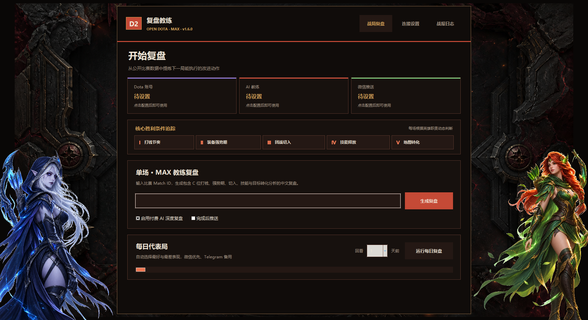
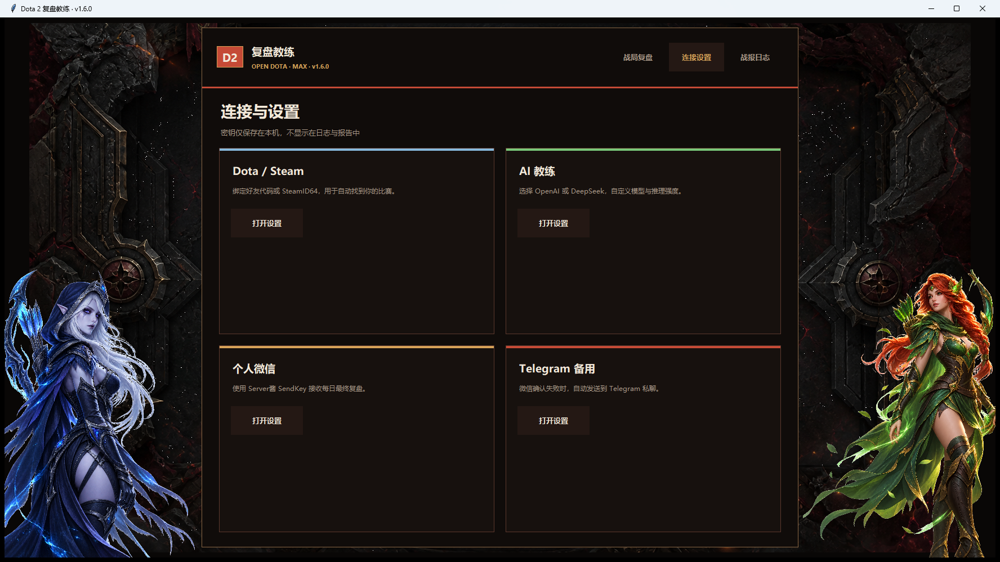

# Dota 2 OpenDota · MAX 复盘教练

从 OpenDota 公开数据生成中文比赛复盘，支持 Windows 图形界面、OpenWrt/iStoreOS 每日常驻任务、OpenAI 或 DeepSeek 深度分析，以及“个人微信优先、Telegram 失败兜底”的自动推送。





## v1.9.0 重点更新

- 所有 AI 复盘统一加载仓库中的 `dota2_review_skill.md`，严格执行证据分级、责任归因、十段固定报告和量化训练规则。
- OpenAI 路线通过 Responses API 的官方 `web_search` 工具核对 Dota 2/OpenDota 权威网页；DeepSeek 不伪装原生联网，只使用程序提供的在线版本锚点，证据不足时明确“版本待校准”。
- 同英雄 3/5/10 局专项复盘复用单场自动复盘的阵容、职责、出装、技能、团战与关键死亡证据卡，不再仅凭均值自由发挥。
- Windows 定时任务改为 `--windowed` EXE 或 `pythonw.exe` 静默运行，日志留在本地；设置弹窗始终相对主界面居中并限制在屏幕范围内。

以往版本的功能变化完整保留在 [`CHANGELOG.md`](CHANGELOG.md)，本节只展示当前版本新增内容。

## Windows：小白直接使用

1. 下载仓库 `dist` 目录中的 [`dota2-opendota-review-v1.9.0-windows.zip`](dist/dota2-opendota-review-v1.9.0-windows.zip)。
2. 解压后把 `Dota2ReviewCoach-v1.9.0.exe` 放入一个长期使用的文件夹。
3. 双击运行，进入“连接设置”。
4. 依次设置 Dota 好友代码或 SteamID64、OpenAI/DeepSeek API、Server酱 SendKey，以及可选的 Telegram 备用渠道。
5. 回到“战局复盘”：输入 Match ID 生成单场复盘，或点击“运行每日复盘”。启用状态会显示清晰的绿色 `✔`。
6. 需要自动运行时，点击每日代表局下方的“设置 / 修改时间”，选择小时和分钟后保存。

### 英雄专项训练

1. 在顶部进入“英雄训练”。
2. 从下拉列表选择英雄，再选择自己的近期样本：3、5 或 10 局。
3. 选择对比方式：
   - **仅分析个人近期趋势**：比较自己这些比赛中的发挥变化；
   - **对比近期职业比赛**：额外读取最近 3 或 5 场职业同英雄比赛；
   - **对比近期高分路人局**：额外读取最近 3 或 5 场高分公开同英雄比赛。
4. 在“复盘记录存放位置”点击“选择文件夹”。该选择会保存，之后单场、每日和英雄专项均使用此目录。
5. 点击“生成英雄专项复盘”。报告位于所选目录的 `hero_studies` 子目录。

对比报告会汇总胜率、KDA、GPM、XPM、补刀、英雄伤害与建筑伤害，并保留每场 Match ID。AI 还会逐局分析阵容与选人合理性，并把趋势转成带准备方法、练习次数、成功标准和降级练法的训练计划。职业/高分数据是参考样本，AI 会考虑比赛节奏与位置差异，不会要求玩家机械照抄职业出装。OpenDota 可能暂时没有某个冷门英雄的近期职业样本，此时可改用高分路人或个人趋势模式。

命令行也可使用：

```powershell
py dota2_review.py --hero-review 8 --history-count 10 --compare-source high_rank --benchmark-count 5 --output-root D:\Dota复盘
```

API Key、SendKey 和 Telegram Token 只保存在 EXE 所在目录的本地 JSON 设置文件中，不显示在界面日志和复盘报告里。调用 AI 会产生对应平台的 API 费用；连接测试只发送极小请求。

Windows 也可用纯命令行版本：安装 Python 3.10 或更高版本后双击 `run.bat`，或执行：

```powershell
py dota2_review.py 8943397976
py dota2_review.py --daily --day-offset 1
```

### Windows 每日定时复盘

图形界面会创建名为 `Dota2 Review Coach Daily` 的 Windows 计划任务：

1. 把 EXE 放入长期不移动的目录。
2. 在“战局复盘 → 每日代表局”点击“设置 / 修改时间”。
3. 从小时和分钟下拉框选择时间，例如每天 `06:15`。
4. 点击“保存并启用”；状态栏显示 `✔ 已启用：每天 06:15` 即完成。
5. 以后修改时间只需重新进入并保存，不会重复创建任务；点击“停用定时任务”即可关闭。

定时任务会调用同一个无控制台 EXE 的后台每日模式，沿用已保存的 Steam、AI、微信和 Telegram 设置；日志写入 EXE 旁的 `daily_logs/windows-scheduled.log`，不会弹出命令提示窗口。源码运行必须使用随官方 Python for Windows 安装的 `pythonw.exe`；程序不会回退到会弹窗的 `python.exe`。升级后重新保存一次定时时间会迁移到统一任务名 `Dota2 Review Coach Daily`。

## AI 教练如何分析

程序可在设置中自由选择 OpenAI 或 DeepSeek。服务商与推理强度是只读下拉选项；模型既可从推荐列表选择，也可手动输入平台支持的新模型名称。首次配置：

```sh
python3 dota2_review.py --setup-ai
python3 dota2_review.py --show-ai
python3 dota2_review.py --test-ai
```

AI 提示词会加载 [`dota2_review_skill.md`](dota2_review_skill.md)，强制区分“数据事实、画面推断、用户陈述、教练假设”，并要求：

- 先给出一至五号位倾向、证据和置信度；
- 同时指出可复制的优点与拖累胜率的问题；
- 只深挖 2–4 个真正决定胜负、且下一局可以改变的问题；
- 按对线、强势期、刷钱路线、团战、控图/肉山/推塔转化还原因果链；
- 结合双方阵容和真实 BP 顺序评价选人，给出不受最终胜负影响的 1–10 分；
- 最后给出三条“触发信号 → 当场动作 → 赛后指标”的训练任务。

最终 AI 报告必须按“一句话结论 → 责任归因表 → 证据摘要 → 关键时间窗 → 用户个人评价 → 队友评价 → 地图与团战建议 → 下一阶段训练 → 量化验收 → 下次所需材料”十段输出。缺段或乱序会被本地校验拒绝，不会保存或推送为最终复盘。

OpenAI 使用官方 Responses API 联网搜索，并把搜索域限制为 `dota2.com` 和 `opendota.com`。DeepSeek 标准 API 在本项目中没有可验证的原生网页搜索工具，因此程序会把 OpenDota 的对局 `patch` 字段映射为补丁名称和 Dota 2 官方补丁入口；映射失败或资料不足时，AI 必须停止版本数值/机制推断。联网搜索可能产生额外 API 费用。

OpenDota 没有录像画面。程序不会假装看过 Replay；走位细节、视野边缘和具体最后一击技能无法由数据证明时，报告会提示需要结合录像确认。

## 个人微信主推送与 Telegram 兜底

个人微信通过 [Server酱](https://sct.ftqq.com/) 推送：

```sh
python3 dota2_review.py --setup-wechat
python3 dota2_review.py --test-wechat
python3 dota2_review.py --show-wechat
```

Telegram 备用推送：

```sh
python3 dota2_review.py --setup-telegram
python3 dota2_review.py --test-telegram
```

发送顺序固定为：

1. 先把 AI 最终复盘正文发送到个人微信。
2. Server酱明确返回成功后结束，不重复发送 Telegram。
3. 微信未配置、读取失败或接口未确认成功时，才把消息和 Markdown 附件发送到 Telegram。
4. 两个渠道均失败时保留本地文件，下次运行继续重试。

单场生成并推送：

```sh
python3 dota2_review.py 8943397976 --send --parse-timeout 60 --no-open-project
```

旧参数 `--send-telegram` 仍兼容，但同样执行“微信优先、Telegram 兜底”。

## iStoreOS / OpenWrt 完整更新与安装

下载 [`dota2-opendota-review-v1.9.0-openwrt.zip`](dist/dota2-opendota-review-v1.9.0-openwrt.zip)。这是不含 GUI、图片与 Windows 运行时的精简包。

建议放在持久化磁盘，例如 `/mnt/data_sda3/dota2-review`，不要放进固件临时目录。

### 1. 安装运行环境

```sh
opkg update
opkg install python3 python3-urllib python3-openssl ca-bundle
mkdir -p /mnt/data_sda3/dota2-review
cd /mnt/data_sda3/dota2-review
```

把仓库中的 `dota2_review.py`、`dota2_review_skill.md`、`dota_zh_names.json`、`hero_names_zh.json`、`run_daily_review.sh`、`install_openwrt_cron.sh` 和 `uninstall_openwrt_cron.sh` 上传到该目录。

### 2. 配置账号、AI 与推送

```sh
cd /mnt/data_sda3/dota2-review
python3 dota2_review.py --set-steam 你的Dota好友代码
python3 dota2_review.py --setup-ai
python3 dota2_review.py --setup-wechat
python3 dota2_review.py --setup-telegram
```

Telegram 是备用渠道，不使用可以跳过。所有密钥输入时均不会显示。

### 3. 安装每日任务

```sh
chmod +x run_daily_review.sh install_openwrt_cron.sh uninstall_openwrt_cron.sh
./install_openwrt_cron.sh 06:15 30
```

含义：每天 06:15 复盘前一个自然日，历史大文件保留 30 天。请先确认软路由时区为 `Asia/Shanghai`。

### 4. 检查与手动测试

```sh
python3 dota2_review.py --version
python3 dota2_review.py --show-ai
python3 dota2_review.py --show-wechat
grep -A 2 DOTA2_DAILY_REVIEW /etc/crontabs/root
python3 dota2_review.py --daily --day-offset 1 --no-open-project
tail -n 100 daily_logs/openwrt-latest.log
```

如果 AI 失败，不会发送残缺结果、不会标记为已完成，也不会删除当天文件；下一次 cron 会重试。目标日期没有比赛时只发送“今日无比赛”，不会误用旧 Match ID。

更新旧版本时先备份，再覆盖程序文件；不要覆盖密钥设置：

```sh
cd /mnt/data_sda3/dota2-review
cp dota2_review.py dota2_review.py.bak
# 上传新版程序和两个中文名称 JSON 后：
python3 dota2_review.py --version
python3 dota2_review.py --test-ai
python3 dota2_review.py --test-wechat
```

以下本地文件应保留且不要上传到 GitHub：`settings.json`、`ai_settings.json`、`serverchan_settings.json`、`telegram_settings.json`、`daily_state.json`。

## 数据完整性与存储清理

程序会在需要时向 OpenDota 请求 Parse，每 10 分钟检查一次，最长等待 60 分钟。只有经济曲线、购买记录和死亡时间线完整时，每日任务才生成最终复盘。

```sh
# 预览 30 天保留策略
python3 dota2_review.py --cleanup-only --cleanup-dry-run --retention-days 30

# 执行清理
python3 dota2_review.py --cleanup-only --retention-days 30

# 清空 reports、daily_logs 和 .cache，保留设置与防重复记录
python3 dota2_review.py --purge-generated-data
```

推送确认成功后，程序会写入防重复记录并删除本次临时报告；所有渠道失败时保留文件。

## 开发、测试与 Windows 打包

项目运行时只使用 Python 标准库。执行测试：

```powershell
py -m unittest discover -s tests -v
py -m py_compile dota2_review.py dota2_review_gui.py
```

重新构建 Windows EXE：

```powershell
powershell -ExecutionPolicy Bypass -File .\build_windows.ps1
```

构建脚本会安装/更新 PyInstaller，输出到 `dist\Dota2ReviewCoach-v<版本>.exe`，并打印 SHA-256。

## 第三方与 AI 素材来源

完整清单见 [`THIRD_PARTY_NOTICES.md`](THIRD_PARTY_NOTICES.md)，其中逐项标注：

- CPython/Tkinter、PyInstaller 和 OpenDota 的用途及上游地址；
- OpenAI、DeepSeek、Server酱和 Telegram 等外部服务；
- 三张 AI 生成视觉素材的文件名、用途和提示词概要；
- 用户提供的 Dota 2 主页面截图只作配色参考，未进入仓库或 EXE。

## 说明

本项目是非官方社区工具，与 Valve、Dota 2、OpenDota、OpenAI、DeepSeek、Server酱或 Telegram 无隶属关系。界面背景与两侧角色素材为本项目原创 AI 辅助生成的同人风格视觉素材，不是 Valve 官方美术；Dota 2 相关名称与商标归其权利人所有。
